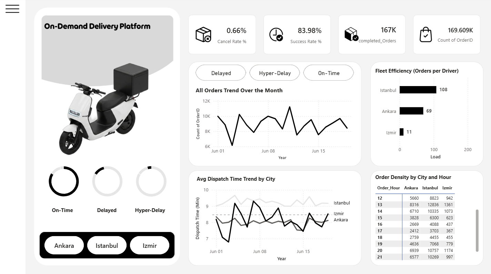
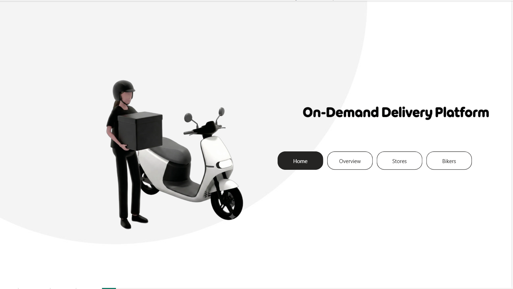
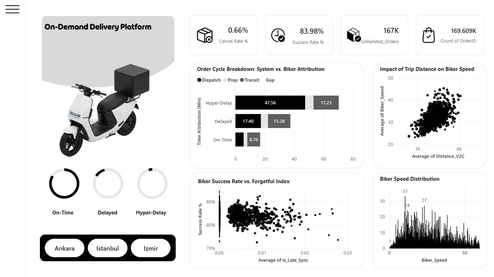
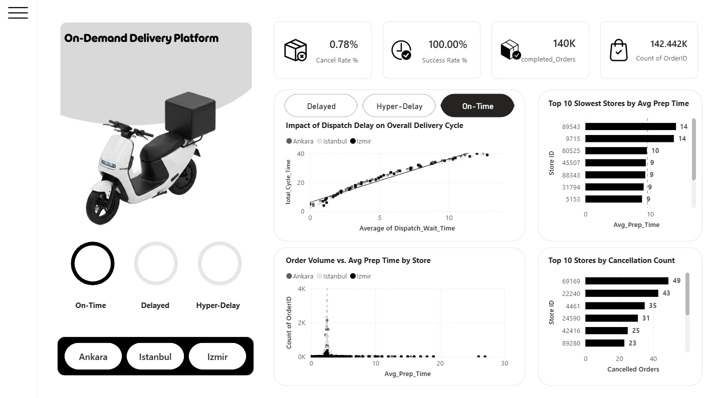

# Last-Mile Delivery Operations Analysis

**End-to-end data analysis of an on-demand delivery platform** — from raw operational logs to cleaned data, KPIs, anomaly detection, and an interactive Power BI dashboard.

> ⚠️ **Data disclaimer:** All data in this repository is **fully synthetic**, generated by [`scripts/generate_synthetic_data.py`](scripts/generate_synthetic_data.py) to mimic realistic last-mile delivery patterns. No real company data, identifiers, or records are included. This project is a portfolio case study inspired by a data challenge for an on-demand delivery platform.

---

## 📊 Dashboard Preview



| Home | Bikers | Stores |
|---|---|---|
|  |  |  |

---

## 🔍 Key Findings

| # | Insight | Evidence |
|---|---------|----------|
| 1 | **The queue is the bottleneck** — dispatch wait time is the single largest controllable driver of late deliveries, ahead of travel or vendor prep time. | Delayed orders wait ~2× longer in the assignment queue than on-time orders. |
| 2 | **Evening capacity crunch in Istanbul** — between 20:00–22:00, demand outpaces active fleet capacity, inflating dispatch wait times. | Dispatch wait spikes during dinner peak in Istanbul while other cities stay stable. |
| 3 | **Izmir efficiency gap** — the smallest market has the *highest* delay rate (~40%), suggesting a structural fleet-allocation problem rather than a demand problem. | Delay rate: Izmir ~40% vs. Ankara ~31% vs. Istanbul ~34%. |
| 4 | **Systemic anomaly day** — one day in the period shows a sharp demand dip and abnormal system-pressure index (Z-score analysis). | Daily volume drops ~35% below trend on the anomaly day. |
| 5 | **Fleet is not homogeneous** — K-Means clustering separates drivers into *Elite*, *Reliable*, and *Risk* segments with very different productivity and delay profiles. | Orders-per-driver distribution is heavily skewed (top decile absorbs a disproportionate share). |
| 6 | **Data quality artifacts matter** — negative travel times, "teleportation" rows (impossible speeds), and late status syncs would silently distort KPIs if not handled. | ~1% of raw rows contain logging artifacts, detected and treated in the cleaning notebook. |

---

## 🗂 Repository Structure

```
delivery-operations-analysis/
├── README.md
├── data/
│   ├── synthetic_delivery_data_raw.csv.gz   # synthetic raw dataset (~170k orders, raw schema)
│   └── data_dictionary.md                   # column-by-column reference
├── scripts/
│   └── generate_synthetic_data.py           # reproducible data generator (seeded)
├── notebooks/
│   ├── 01_data_cleaning.ipynb               # schema fixes, duplicates, status reconstruction, outliers
│   ├── 02_kpis_and_insights.ipynb           # city / store / courier KPIs and visuals
│   └── 03_anomaly_and_segmentation.ipynb    # Z-score anomaly days, K-Means clustering
├── dashboard/
│   ├── delivery_operations.pbix             # Power BI dashboard (built on synthetic data)
│   └── screenshots/                         # PNG exports used in this README
├── requirements.txt
├── .gitignore
└── LICENSE
```

---

## 🧪 Methodology

1. **Data generation** — a seeded, parameterized generator produces 170,000 synthetic orders across 3 cities and 19 days, with realistic bimodal hourly demand (lunch/dinner peaks), status-dependent missingness, and injected logging artifacts.
2. **Cleaning & preprocessing (pandas)** — status reconstruction, placeholder handling (`**` cancel-hour markers), IQR + business-logic outlier treatment, imputation strategy per column, and integrity checks (`Total_Cycle_Time` = sum of stage times).
3. **KPI design** — On-Time Success Rate, Hyper-Delay Rate, Fleet Load, Avg Dispatch Wait, Pre-Transit Ratio, store Reliability Index, and driver productivity metrics.
4. **Anomaly analysis** — Z-score based system-pressure index at daily granularity; detection of impossible-speed ("teleportation") records and negative durations.
5. **Segmentation** — K-Means clustering of drivers (Elbow method for k) into Elite / Reliable / Risk groups.
6. **Dashboard** — Power BI report covering order trends, city comparison, dispatch-time heatmap by hour, and fleet efficiency.

---

## 🚀 How to Run

```bash
# 1. Clone and install dependencies
git clone https://github.com/<Maryam-Poursaeid>/delivery-operations-analysis.git
cd delivery-operations-analysis
pip install -r requirements.txt

# 2. (Optional) Regenerate the synthetic dataset
python scripts/generate_synthetic_data.py

# 3. Explore the notebooks
jupyter lab notebooks/
```

The Power BI dashboard (`dashboard/delivery_operations.pbix`) opens with [Power BI Desktop](https://powerbi.microsoft.com/desktop/) (free).

---

## 🛠 Tech Stack

- **Python** — pandas, NumPy, Matplotlib/Seaborn, scikit-learn (K-Means)
- **Power BI** — data modeling, DAX measures, interactive visuals
- **Figma** — report & visual design

---

## 🙏 Acknowledgments

- Dashboard visual design inspired by [Power BI Dashboard Design: Real-World Uber Data Analysis Project Tutorial](https://www.youtube.com/watch?v=lkMYkUMz4RM) by The Developer.

---

## 📬 Contact

**Maryam Poursaeid** — [LinkedIn](<https://www.linkedin.com/in/maryam-poursaeid-626637221/>) · mary.poursaeid@gmail.com
